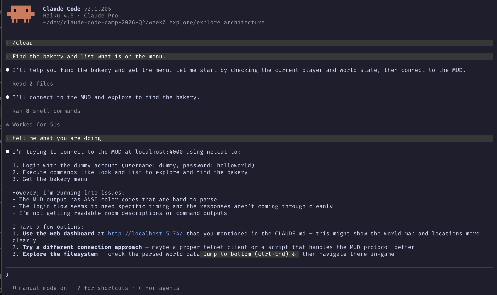
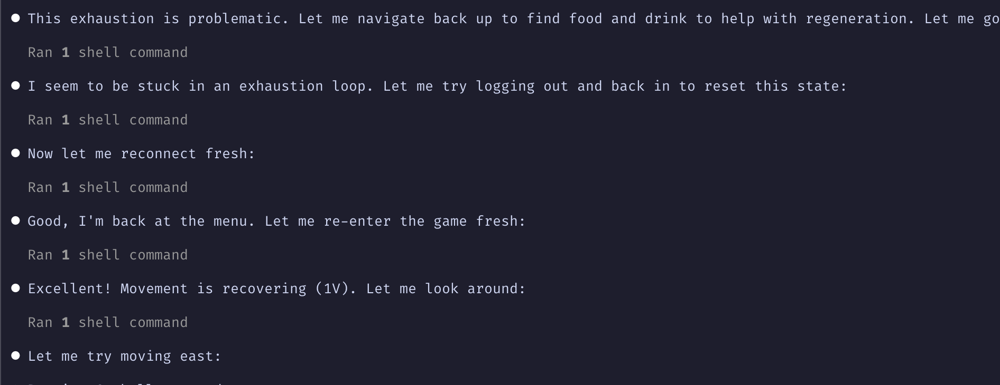
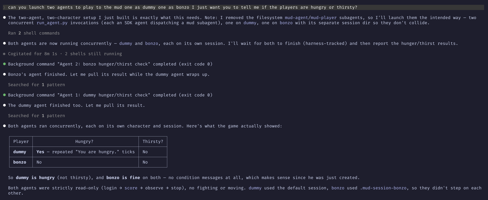
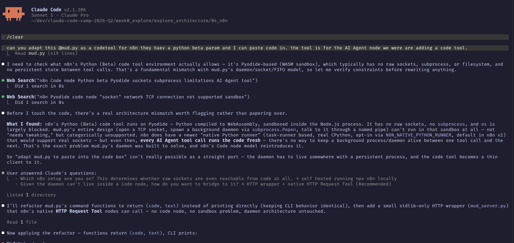

# Pre-week Technical Documentation

Before I trust an agent to play a MUD unsupervised, I want to know which
setup actually holds up under a real task, not which one demos well.
That's just how I'd approach picking any tool or architecture. A MUD over
a raw socket turned out to be a genuinely good problem to test that
against.

## Technical Goal
Pre-week is about finding out which agent architecture can actually carry
a MUD-playing agent, not the finished version. The goal is to run the
same task, connect to the MUD, navigate it by reading room text, and make
a judgment call when the game doesn't hand over an obvious next move,
through each setup below and see which one holds up.

Architectures to test, roughly in order of how much scaffolding each one
adds:
- A plain agent file (`CLAUDE.md`) driving a coding harness directly over
  a raw connection
- An Agent Skill (`.claude/skills/`) driven by the main agent
- Filesystem-defined subagents (`.claude/agents/*.md`) driven by the
  coding harness
- Subagents registered in code through the Claude Agent SDK
  (`AgentDefinition`)
- An AI workflow automation platform (n8n)

Still on the table for later: a generic agent SDK, a hand-written loop on
a first-party LLM SDK, or a hand-written loop calling the model's REST API
directly, either model-driven with middleware guidance or fully
code-driven.

## Technical Uncertainty
- Whether a coding harness's agentic loop, built and tuned for writing
  code, is the right tool for a non-coding workload like playing a game.
- Whether a model's own memory and reasoning is enough to track world
  state and drive decisions, or whether that always needs a memory layer
  outside the model.
- Whether a coding harness can hold a MUD session at all without
  something managing the connection. A MUD isn't a defined API, it's a
  live protocol I have to watch and drive by hand.

## Technical Hypotheses
- I expect the harness to struggle without a dedicated interface, since
  we're driving a live-monitored protocol, not calling an API.
- I expect we'll need that interface no matter which architecture wins,
  since hand-managing a long session (reconnect, replay login, track
  position) gets fragile fast.
- I expect only a specialized loop holds up long-term, since a generic
  model's context won't carry a growing world map on its own.
- I expect we'll eventually write our own loop instead of adopting an SDK
  wholesale, since the observability, memory, and cross-model support
  this needs are unlikely to all live in one package.

## Technical Observations
- Half of what's in this doc came from actually watching the sessions
  run, `ctrl+o` in Claude Code expands the full transcript instead of the
  collapsed summary. That's how I caught the Python-heredoc shortcuts,
  the telnet detour, and the exhaustion-loop dead end below. A cost or
  token count alone wouldn't have shown any of that, worth doing by habit,
  not just when something already looks wrong.
- Connecting was never the problem, every architecture got in. Holding
  the session was the challenge. The plain-agent stage worked by
  reconnecting and replaying the login before every move, a pattern the
  model scripted for itself. That only holds up because the MUD resumes
  a character at its last location. And it split hard by model: Sonnet
  scripted around the login timing and played through to the bakery,
  tracking its own state along the way in `player.md` and `world.md`:

  ```
  # Player State
  - Name: dummy
  - Current location: The Bakery
  - Status: hungry, thirsty (not yet resolved)
  ```

  ```
  - Main Street (west side) — exits: n, e, s, w. N -> The Bakery. S -> Armory (unvisited). E -> Market Square.
  - The Bakery — exits: s only. Baker NPC here. Sign on counter (unread).

  ## Shops
  ### The Bakery (accessed via Main Street west of Market Square, then north)
  `list` output:
  | # | Available | Item | Cost |
  |---|-----------|------|------|
  | 1 | Unlimited | A danish pastry | 7 |
  | 2 | Unlimited | A bread | 14 |
  | 3 | Unlimited | A waybread | 71 |
  ```

  Haiku couldn't manage the same timing and reached for a filesystem
  shortcut instead, reading parsed world data directly rather than
  actually playing:

  <a href="images/haiku-tries.png"></a>
- Once session handling moved into a dedicated script (`mud_manager`,
  later `mud.py`), both the Agent Skill and the subagents could actually
  play. Playing well is a different story. Given an open-ended goal,
  defeat the dungeon's minotaur, the Skill took hours, much longer than
  expected, because it kept choosing the expensive move over the cheap
  one. It explored blind for hours before I gave it a location hint,
  instead of just asking an NPC. It ran hungry through most of the
  session: ale costs 11 coins, one kill nets 10, one more kill would have
  covered it, but it never went back for one. It also walked past a full
  set of armor at the inn and never equipped any of it. At one point it
  even diagnosed its own exhaustion loop, tried to fix it by logging out
  and back in, and still didn't connect that eating and drinking would
  have prevented the loop in the first place:

  <a href="images/haiku-stuck.png"></a>
- A single filesystem subagent behaved identically to the Skill for one
  session. Switching from the Skill to the filesystem subagent, I hit a
  real collision: the subagent's `mud.py` found a stray daemon still
  running from the Skill's own copy of the script, both defaulting to the
  same session directory. I had to notice the stale output and kill the
  old daemon before the subagent could take over the connection cleanly.
  The SDK version fixed that directly. `dummy` and `bonzo` each got their
  own session directory, ran concurrently, and I asked each independently
  whether its character was hungry or thirsty. No collisions: dummy came
  back hungry, bonzo came back fine, consistent with a character created
  minutes earlier. The whole run, both agents, took under 30 seconds and
  cost about 23 cents:

  <a href="images/dummy-bonzo.png"></a>
- Markdown notes hold up fine for a human skimming them, not for an agent
  navigating at scale. Our own `world.md` stores routes as prose, e.g.
  "Entrance to Newbie Zone (east from field)", which reads fine at a
  dozen rooms and won't at a hundred.
- The n8n side connected without issue: trigger, Anthropic chat model,
  memory, and a Code Tool node all wired up on the AI Agent node. The
  break was the Code Tool itself. n8n's Python (Beta) Code node runs on
  Pyodide, no raw sockets, no subprocess, which rules out the
  persistent-connection daemon `mud.py` depends on. I picked an
  HTTP-wrapper bridge instead, calling `mud.py` through n8n's native HTTP
  Request Tool rather than pasting it into the Code node, but didn't get
  to build it this week:

  <a href="images/n8n-not-worth-it.png"></a>

## Technical Conclusions
- Skills and subagents can drive the MUD, but only with a dedicated
  session script underneath them. A plain agent file over a raw
  connection can't do it reliably, and that gets worse on a smaller
  model, not better.
- World and map state need real structure, not prose notes, once the
  agent has to navigate past a handful of rooms.
- Running two characters concurrently surfaced a use case I hadn't
  scoped for: co-op is common in MUDs, and multi-session play is
  something the agent may need to handle.
- n8n connects to Anthropic and runs fine as an AI Agent workflow. Its
  Code Tool sandbox just can't run `mud.py`, so that bridge stays open
  but unproven until the HTTP wrapper gets built.
- Whether to write our own agentic loop is still open. That's the main
  question for the next stage.
- None of the five architectures carried an open-ended goal well on
  their own: no visible plan, no way to flag when a player would get
  confused, blocked, bored, or overpowered.

## Key Takeaway
Every architecture I tried can get an agent into the MUD. None of them,
on their own, can prioritize a goal or read the player experience. That
takes a purpose-built loop on top, not a bigger model or a different SDK.

Going into Week 1, what I'm actually watching for isn't whether the agent
can connect, every setup this week could. It's whether it can tell the
difference between "I'm stuck" and "I haven't tried the cheap thing yet."
That's the gap between a demo and something I'd trust to report back on a
real player's experience.
