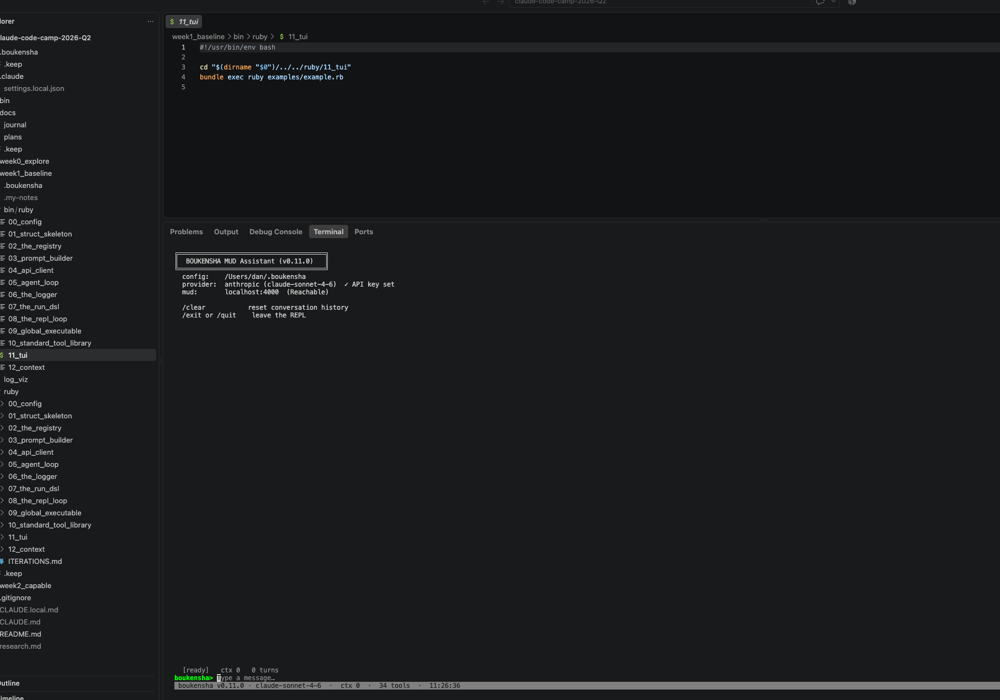
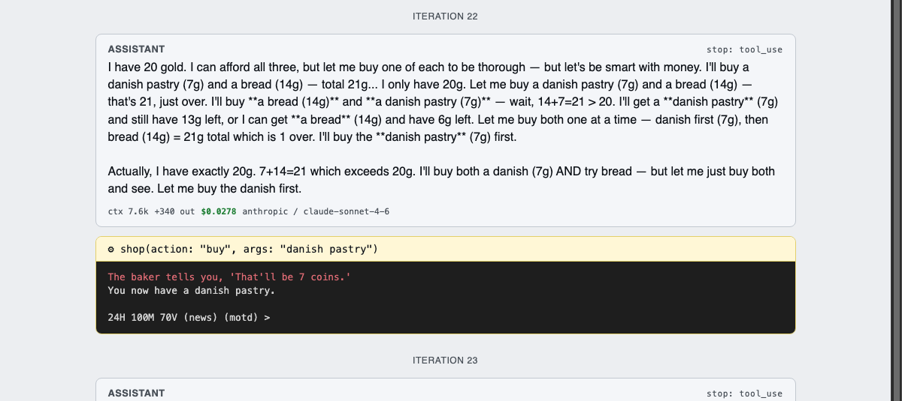
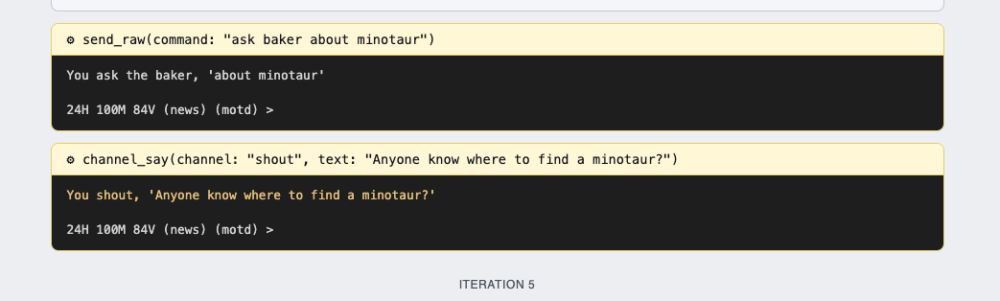
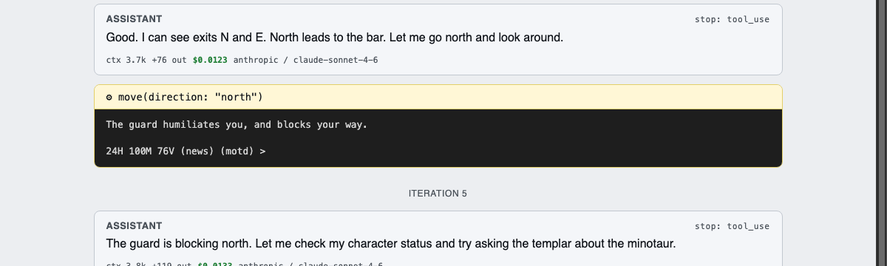
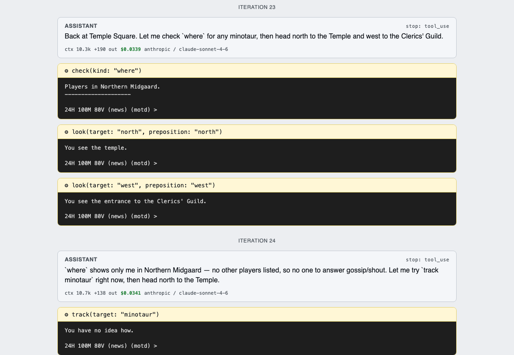
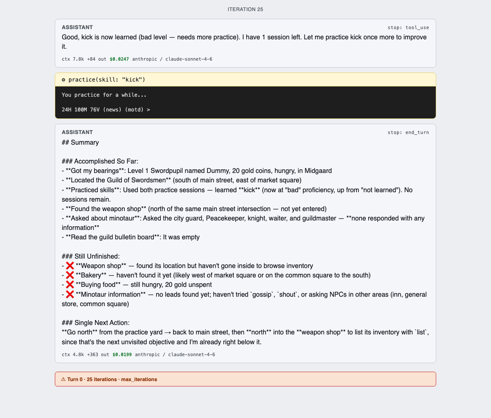

# Week 1 Technical Documentation

The QnA team's suspicion is that players get confused, blocked, bored, or
overpowered somewhere in the journey, and before an agent can report on
any of that it has to be able to make the journey itself. Week 0 answered
a narrower question, which architecture can even hold a MUD session. Week
1 is where that question got an answer to build on: `Boukensha`, the
bootcamp's own teaching framework (`boukensha.gemspec` credits Andrew
Brown/ExamPro as the author), built up through its own thirteen-step
iteration path
(`week1_baseline/ruby/00_config` through `12_context`, see `ITERATIONS.md`)
and modified wherever the live scenario actually needed it, not designed
from scratch. This entry is about using that base to answer the question
Arcane Loop actually asked: can this agent navigate a traditional MUD on
its own, before it gets anywhere near their live world, player data, or
proprietary game systems.

## Technical Goal
Take the instructor-provided Boukensha framework and build it up step by
step into a baseline agent with every component a MUD-playing agent
needs: an agentic loop, a tool registry, five interchangeable LLM
backends behind one normalized request/response shape, structured
logging, a DSL, global binary execution, a standard tool library, a
terminal UI, and context management, patching the vendor code as needed
along the way rather than rewriting it. Then prove the finished thing can
actually get somewhere in a live MUD, guided only by a general player's
guide, not a scripted example.

## Technical Uncertainty
- Whether the loop and its tool dispatch, exercised so far only against
  each step's own clean example script, would hold up navigating a real
  MUD it hadn't been scripted for, using nothing but a player's guide and
  its own judgment about what the world actually showed it.
- Whether the connection-handling code underneath it, session lifecycle,
  reconnects, would survive a real, messy live session rather than the
  single-shot connects it had only been smoke-tested against.
- Whether a stateless, single-call run, no REPL, no memory across turns,
  could still produce anything resembling the signal the scenario cares
  about: a player-journey moment worth reporting, not just a completed
  path.

## Technical Hypotheses
- I expected the agent loop and tool dispatch to be the solid part by
  navigation time, since that had been built and reviewed across most of
  the week's steps, and expected the live connection-handling path to be
  the weak point instead, since it had never been exercised live before.
- I expected a general player's guide to be an imperfect map for this
  particular server, and wanted to see whether the agent would trust it
  blindly or verify against what the world actually showed it.

## Technical Observations
The build itself came together as thirteen small steps
(`week1_baseline/ruby/00_config` through `12_context`), each its own
working Bundler project. Most of what surfaced was ordinary patching: an
API schema change on Anthropic's side needed one line to fix, then had to
be caught again after later steps quietly reverted it. The one real
engineering find was in connection handling, not the loop: a
reader-thread `ensure` block marked a connection closed without clearing
the socket reference, so the agent's own status check said "disconnected"
while the reconnect guard still saw a live socket and refused. One line
fixed it.

With that fixed, I ran the scenario: a single stateless `Boukensha.run`
call, Claude Sonnet 4.6, no REPL, no memory beyond that call, told to get
from the Temple of Midgaard to the Donation Room (session excerpt:
[`sessions/2026-08-22-step11-navigation-replay.md`](sessions/2026-08-22-step11-navigation-replay.md)).
On its own the agent got lost, so I gave it a CircleMUD navigation guide
as a course correction, one Claude's research mode put together
beforehand rather than me writing it by hand. It had the same problem
Week 0 already flagged (`docs/journal/0_preweek.md`: our own `world.md`
stored routes as prose, fine at a dozen rooms and not at a hundred),
prose directions, not structured data, and it was wrong for this server
on top of that: it puts the Donation Room northwest of Market Square.
It's actually one step east of the Temple, stated outright in the
Temple's own room text ("the donation room is in a small alcove to your
east"), and the agent matched its move to that instead: 6 iterations, 25
seconds, 24,505 input / 814 output tokens, $0.09 total. It treated the
guide as a hint, not an instruction, and caught the mismatch immediately.
One more moment stood out: an NPC handed the character a candle after
noting it was wandering without a light source, an unscripted signal this
stateless run never flagged as a finding, exactly the shape of thing the
finished Player Journey Agent needs to catch.

Every cost figure here, $0.09 for the navigation run and $0.47 for a
longer exploration run, came from log_viz reading raw API usage out of
the JSONL, not an estimate. A 25-iteration session runs under 50 cents at
raw rates, a reminder that a flat-fee AI subscription is subsidizing real
usage: the metered cost per call and the subscription price are two
different numbers, and this is the first project where a tool has put the
first one directly in front of me.

Five longer, open-ended runs pushed past pure navigation: buy food, train
a skill, shop for weapons, and, half as a joke, see if the character
could find anything about a minotaur ahead of an actual hunt planned for
later. It priced out the Weapon Shop, bought a danish pastry at the
Bakery for 7 gold and ate it, and practiced `kick` from "not learned" to
"bad" before running out of practice sessions.

The minotaur search came up empty, the guide has zero mentions of one,
checked directly. Across the five runs the agent asked over a dozen NPCs
"about minotaur" (baker, city guard, peacekeeper, postmaster, bartender,
knight templar, and others), shouted and gossiped the question on open
channels, read an empty bulletin board, tried a `track` command it didn't
have the skill for ("You have no idea how"), and got physically turned
back by a guard blocking a level-gated room ("The guard humiliates you,
and blocks your way").

None of it worked, honestly reported as "found nothing" rather than
padded out. It also correctly figured out it was the only player online
(`where` confirmed that) before wasting turns on the social channels.
Level 1, no `track` skill, a guide with nothing on minotaurs: this
character has no real path to that answer yet, the honest starting point
for whatever the actual hunt looks like once there's a world model to
work from instead of a stateless run asking NPCs one at a time.

## Technical Conclusions
- Navigation itself is solved for the scope this week asked for: given
  only a general guide and no prior knowledge of this server, the agent
  found its way, verified rather than trusted, and recovered from wrong
  turns in one or two moves. $0.09 and 25 seconds is the actual proof of
  that, not a narrative claim of it.
- The agent loop and tool dispatch never needed a rewrite; every real
  issue this week was at the edges, an external API contract and a
  connection path that had never been exercised live.
- The `max_iterations` wind-down (step 5) isn't just a described feature,
  it's been watched firing live five separate times: every one of the
  open-ended exploration runs (buying food, training a skill, shopping for
  weapons, hunting for a minotaur) hit the 25-iteration cap and ended with
  an honest "here's what's done, here's what's not, here's the next
  single action" summary instead of a hard stop or an infinite loop.
- The candle NPC moment is the first real evidence of what Week 2 is
  for: the world already hands out unscripted signals about player
  state. This week's agent walked past one. It didn't miss it because it
  couldn't see it, it missed it because nothing yet asks it to look.
- One known gap carries into Week 2 untested: CircleMUD's duplicate-login
  prompt has no automatic handler. It didn't bite this week only because
  no stale session happened to be open at connect time, that's luck, not
  a fix.

## Key Takeaway
Week 0 asked whether an agent could hold a MUD session; every
architecture could. Week 1 asked whether a purpose-built loop could
actually navigate one it had never seen, trusting nothing it wasn't
shown, and for $0.09 and 25 seconds, it did. But it still can't tell me a
player was confused, it only avoided being confused itself. Closing that
gap, from the agent not getting lost to the agent telling you where a
real player would, is Week 2.
