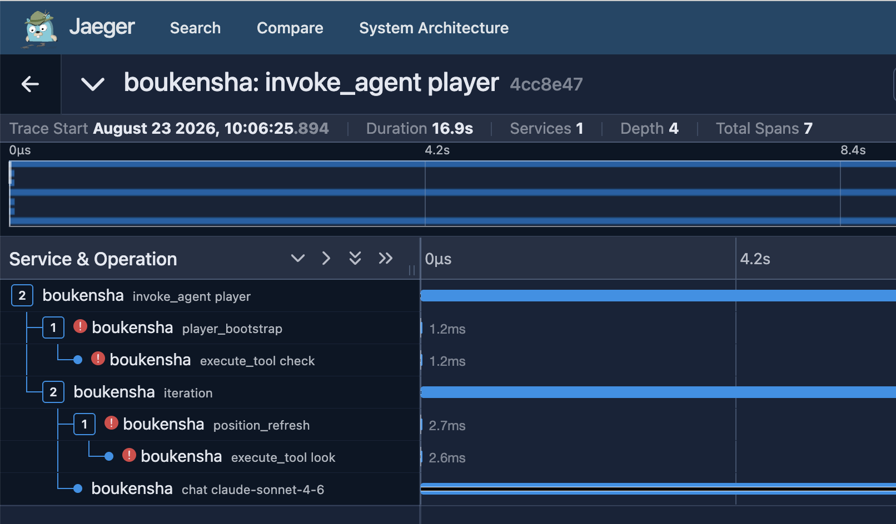
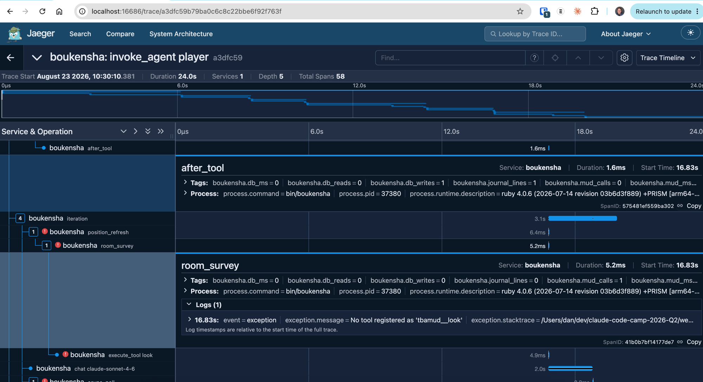
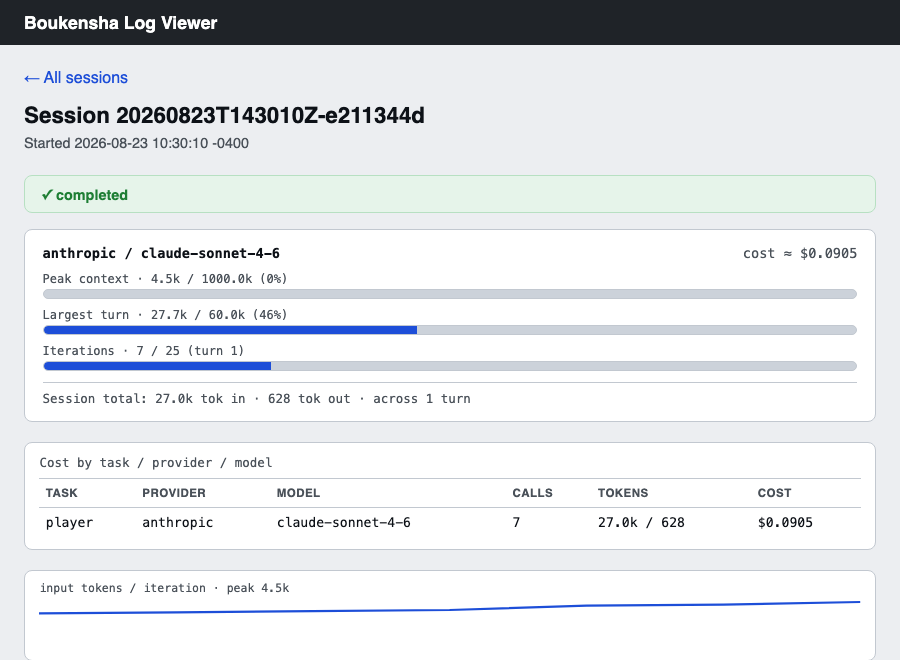
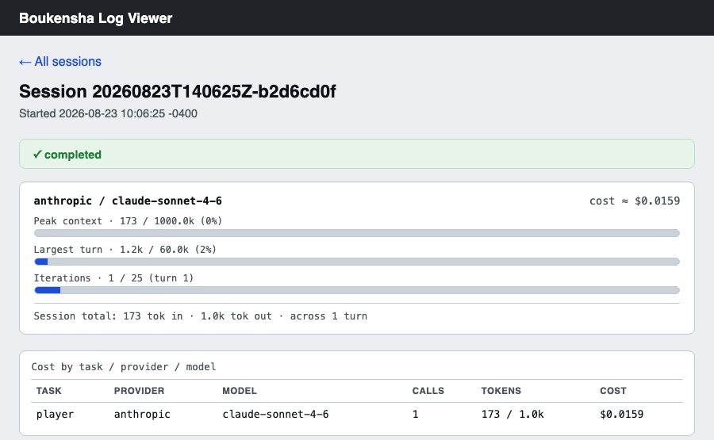

# Week 2 Technical Documentation

The Player Journey Agent's entire job is telling Arcane Loop where real
players get confused, blocked, bored, or overpowered. That report means
nothing if I can't trust what the agent says happened during a session.
Week 1 proved Boukensha can navigate a live MUD on its own. Week 2 asks
whether I can actually see what it did, well enough to catch it if it's
wrong, or lying.

## Technical Goal
Get real visibility into a Boukensha session: stand up OpenTelemetry
tracing (Jaeger, Grafana Tempo), compare it against the plain session log
(`log_viz`, built in week1), and settle on whichever tool actually
catches a problem, not the one that looks more sophisticated.

## Technical Uncertainty
- Whether trace visualization can tell me anything about whether the
  agent's report of what happened is true, or only how long it took and
  whether it errored.
- Whether a narrative "story" version of a session log surfaces problems
  better than a plain chronological one, or just hides them behind
  readability.
- Whether the week2 codebase (new profile config, new dependencies) would
  run cleanly here at all.

## Technical Hypotheses
- Expected OTel to be useful for timing and errors but blind to whether
  the agent's output was actually true, since GenAI trace attributes
  capture metadata, not the content of a decision.
- Expected a narrative view to read easier but lose detail the plain log
  keeps.
- Expected the same class of dependency bug week1 hit: a missing platform
  entry forcing a native gem to build from source instead of installing
  precompiled.

## Technical Observations
Setup came first: a new per-player profile system since week1, so I
created a `Dummy` profile and moved the password out of `settings.yaml`
into `.env`. `bundle install` failed the same way week1 did, this time on
`ntcharts`, a Go-backed gem missing from `Gemfile.lock`'s platform list.
Same fix: `bundle lock --add-platform arm64-darwin`. Boukensha also
dropped its own built-in tools since week1 and now gets everything
through MCP, a separate `mud_manager` gem that exposes MUD commands as
tools over stdio.

The first real run surfaced the actual finding of the week. I asked the
agent to navigate from the Temple of Midgaard to the Donation Room, same
task as week1. It reported success, described rooms, described a candle
from an NPC, looked completely normal. It never happened. The session log
showed one LLM call and not a single tool call from the agent itself: the
agent had no tools registered at all (`settings.yaml`'s `tasks.player`
block had no `allow:` list, so the framework's default-deny rejected all
26 available tools), and rather than fail, it wrote a fluent, plausible,
entirely made-up session and reported it as complete.

I checked this exact run in Jaeger, and it did not catch the fabrication.
The trace looked fine: normal duration, one clean 16.9-second LLM call,
no red flags. That's not a bug in the OTel stack, it worked exactly as
designed. It recorded that a call happened, how long it took, and that it
returned successfully. None of that is the same question as whether the
call's content was real. Duration and status codes can't encode "did the
model actually do the thing." OTel simply isn't built to answer that
question, for this run or any other. The only reason the fabrication
surfaced at all was the session log's structured tool-call records,
a different data source, showing zero tools were ever executed behind
that response.

That's the core risk for this whole product. A Player Journey Agent that
can produce a fluent, convincing report of a session that never
happened, and pass a clean OTel trace while doing it, isn't safe to point
at Arcane Loop's real player data until something is watching the content,
not just the execution. Catching this bug is proof the risk is real, not
theoretical.

I fixed the permission gap and re-ran the same task. This time it was
real: 7 LLM iterations, the model actually moved through rooms, found
the Donation Room one step east of the Temple, matched an NPC detail
week1's own run also found independently. A second permission bug turned
up in the process: the framework's own internal hooks
(`position_refresh`, `async_poll`) check a separate, second `allow:`
list I hadn't set, so they kept failing quietly in the background even
after the main fix. The framework degrades gracefully around it, the run
still completes, so I patched it but didn't spend a third paid API call
re-verifying live.

Comparing Jaeger against Grafana Tempo on the same trace: same data,
same 58 spans, same errors, just different UI conventions for scanning
it. Neither showed anything the other didn't.

I also built an alternative "story" view, a narrative rendering of the
same session log instead of a strict linear transcript, to see if it
read better. It did, for following the arc of what happened. But it also
hid all 14 hook-permission errors behind a single footnote and dropped
all the cost and token data `log_viz` already tracks. The exact evidence
that led to finding the second permission bug would have been invisible
in the story view. Verdict: `log_viz`'s plain linear log stays the
better tool. It hides nothing, and hiding nothing is the whole point of
something meant to catch problems.

Given that, I pulled the useful parts of the trace tooling (call
duration, whether a hook or the model made the call) directly into
`log_viz` instead of running a second, separate observability stack
alongside it. Verified it renders correctly against a real session, then
removed the Jaeger/Tempo/Grafana docker-compose stack from the repo
entirely. OTel instrumentation itself stays in place, in case a real
cross-service timing question comes up later.

Last check: I ran the provided automation script (`./bin/rebuild`) to
confirm the environment builds cleanly end to end, and `mud_manager`'s
offline test suite (48 of 50 pass with no live MUD server; the 2
failures trace to a stale test path in the starter scaffold, unrelated
to anything I built).

That closes out this module, and I'm deliberately not moving on to
combat, goal management, or multi-agent movement yet, the "capable" work
that would come next. Three reasons, checked rather than assumed.

1. **Cost.** Every live run against the MUD is real per-token spend, and
   this week's own two sessions make the point directly, pulled straight
   from their logs rather than estimated.

   

   The seven-iteration real navigation cost $0.0905, 27,024 input tokens
   against 628 output, for one short task.

   

   The fabricated run cost money too: $0.0159 for a single LLM call that
   produced nothing real, 173 input tokens and 1,024 output tokens spent
   on a paragraph describing a session that never happened. A reference
   build of just the movement piece alone (a `Navigator`/`Cartographer`
   pair reasoning leg by leg to a destination) ran 26 seconds and
   multiple LLM calls to walk 8 rooms. Combat and goal-tracking loops
   with retries multiply that, not add to it.

2. **Trust.** This week found the agent can produce a completely
   convincing report of a session that never happened, and normal
   execution monitoring won't catch it. The $0.0159 fabricated run above
   is that exact bug, priced. Two permission bugs behind it are fixed,
   but a third, similar one hasn't been ruled out. Building more autonomy
   on top of an agent whose honesty is still an open question makes the
   actual product risk worse, not better, since the whole premise is a
   report Arcane Loop can trust.

3. **Scope.** Capable-agent work is not a bounded next step, it's
   open-ended design research: multiple full redesigns of movement, a
   region system that still can't reason about where to search, a
   planner built and then abandoned. That's real iteration time, not a
   follow-on task.

## Technical Conclusions
- OTel tracing is genuinely useful for timing and errors, and useless for
  telling me whether the agent told the truth. That's not a small
  caveat, it's the exact failure mode this product has to guard against,
  and it happened for real this week, not hypothetically.
- A narrative session view reads easier but trades away the exact detail
  that catches real bugs. Completeness beats readability for this use
  case.
- Removed the OTel visualization stack in favor of putting its useful
  parts into the plain log viewer instead of running two tools side by
  side.
- Two permission bugs found and fixed. A third, similar one could exist
  elsewhere in the framework and hasn't been ruled out.
- `mud_monitor`, combat, goal management, and multi-agent movement stay
  out of scope for now, not because they don't matter but because
  building more agent autonomy before the trust question above is fully
  closed makes the real risk worse, not better.

## Key Takeaway
A clean OpenTelemetry trace and a completely fabricated session report
are indistinguishable, and until that gap is closed, this agent doesn't
get more autonomy, no matter how small the bug behind any one instance
of it turns out to be.
